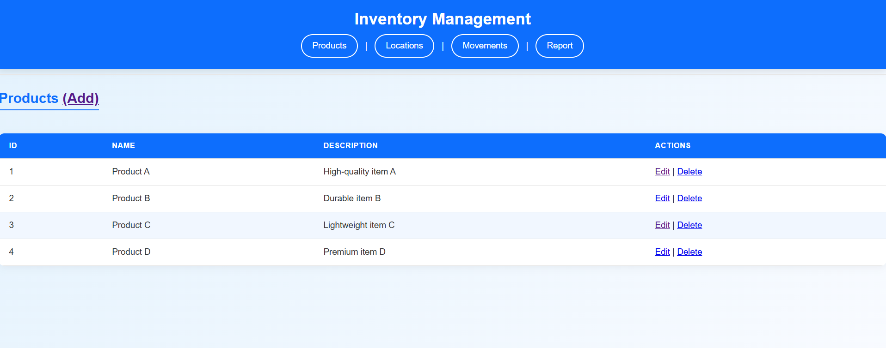
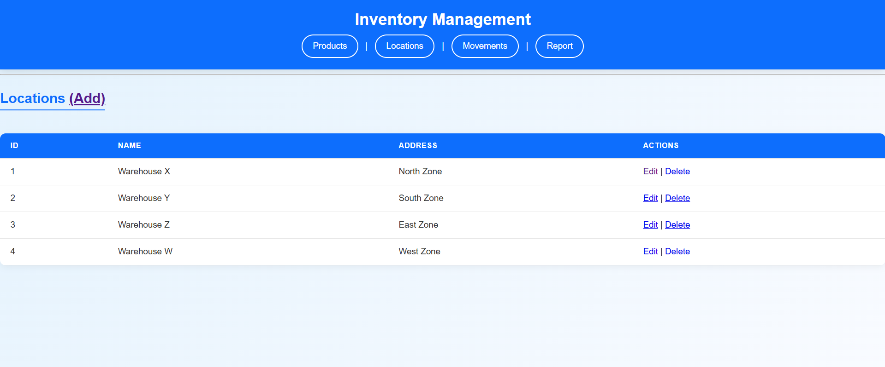
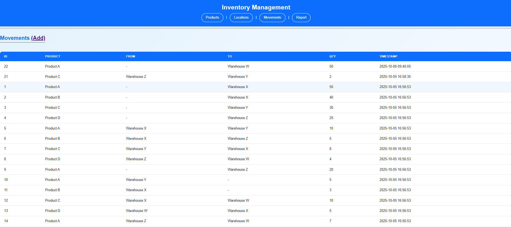
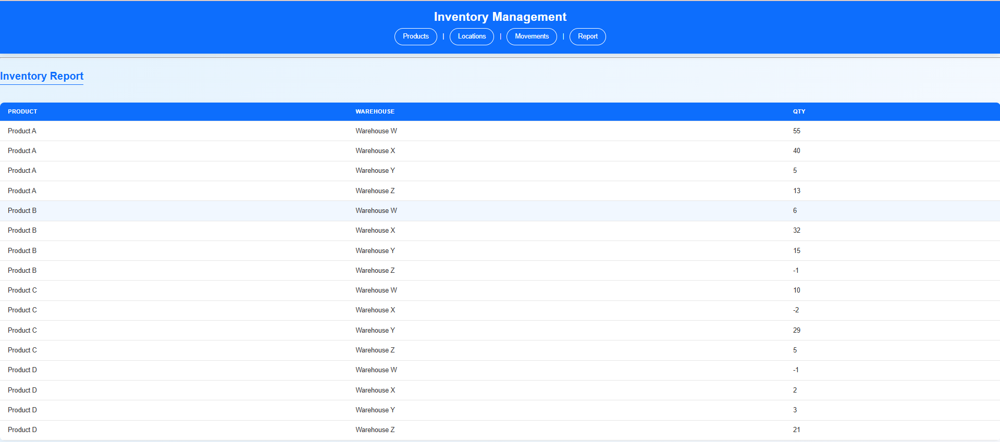
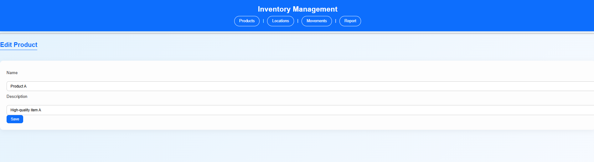
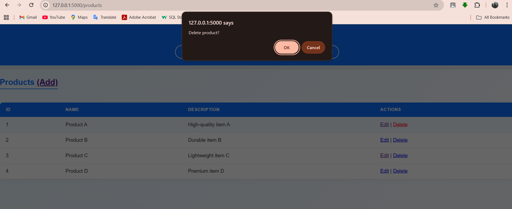

# 📦 Inventory Management System (Flask + MySQL)

A full-featured **web-based inventory management system** built using **Flask** and **MySQL (without ORM)**.  
It enables users to manage products, warehouse locations, and product movements between them — with real-time stock balance reporting.

---

## 🧭 Table of Contents

- [About the Project](#about-the-project)
- [Features](#features)
- [Tech Stack](#tech-stack)
- [Project Structure](#project-structure)
- [Database Schema](#database-schema)
- [Workflow Overview](#workflow-overview)
- [Installation & Setup](#installation--setup)
- [Screenshots](#screenshots)
- [Future Improvements](#future-improvements)
- [Credits](#credits)

---

## 🧩 About the Project

This Flask application was developed to demonstrate **web application design**, **SQL database handling**, and **user-friendly UI creation** without relying on ORM frameworks like SQLAlchemy.

It helps warehouses or shops maintain a digital record of:

- What products exist
- Which warehouse they are stored in
- How quantities move in or out

The app uses **raw SQL queries** for full control and performance, combined with a **modern, responsive UI**.

---

## ✨ Features

✅ **Product Management** – Add, edit, and delete products.  
✅ **Location Management** – Manage warehouse details.  
✅ **Product Movement** – Record incoming, outgoing, and transfer transactions.  
✅ **Inventory Report** – Real-time calculation of stock available in each location.  
✅ **Responsive Interface** – Works beautifully on both desktop and mobile screens.  
✅ **Modern Design** – Gradient theme, hover effects, and glass-style cards.

---

## 🧠 Tech Stack

| Category      | Technology Used                      |
| ------------- | ------------------------------------ |
| **Backend**   | Flask (Python)                       |
| **Database**  | MySQL                                |
| **Frontend**  | HTML, CSS (custom responsive design) |
| **Libraries** | `Flask`, `mysql-connector-python`    |
| **Language**  | Python 3.x                           |

---

## 📂 Project Structure

```

flask_inventory_app/
│
├── app.py               # Main Flask application
├── db_config.py         # MySQL connection configuration
├── requirements.txt     # Dependencies list
├── README.md            # Project documentation
│
├── templates/           # Jinja2 templates for pages
│   ├── base.html
│   ├── products.html
│   ├── add_product.html
│   ├── edit_product.html
│   ├── locations.html
│   ├── add_location.html
│   ├── edit_location.html
│   ├── movements.html
│   ├── add_movement.html
│   └── report.html
│
└── static/
└── style.css        # Modern responsive styling

```

---

## 🗄️ Database Schema

### 📘 Create Database

Run these SQL commands before starting the app:

```sql
CREATE DATABASE inventory_db;
USE inventory_db;

CREATE TABLE Product (
    product_id INT AUTO_INCREMENT PRIMARY KEY,
    name VARCHAR(100) NOT NULL,
    description VARCHAR(255)
);

CREATE TABLE Location (
    location_id INT AUTO_INCREMENT PRIMARY KEY,
    name VARCHAR(100) NOT NULL,
    address VARCHAR(255)
);

CREATE TABLE ProductMovement (
    movement_id INT AUTO_INCREMENT PRIMARY KEY,
    timestamp TIMESTAMP DEFAULT CURRENT_TIMESTAMP,
    from_location INT NULL,
    to_location INT NULL,
    product_id INT NOT NULL,
    qty INT NOT NULL,
    FOREIGN KEY (product_id) REFERENCES Product(product_id),
    FOREIGN KEY (from_location) REFERENCES Location(location_id),
    FOREIGN KEY (to_location) REFERENCES Location(location_id)
);
```

### 💡 Logic Summary

- `from_location` = NULL → product moved _into_ a location
- `to_location` = NULL → product moved _out of_ a location
- Report shows `(Total In) - (Total Out)` per warehouse.

---

## ⚙️ Workflow Overview

1. **Add Products** – Create entries for all items.
2. **Add Locations** – Define warehouse locations.
3. **Record Movements** – Log transfers between warehouses or mark stock received/dispatched.
4. **View Report** – See the total stock of each product across all locations.

---

## 🚀 Installation & Setup

### 1️⃣ Clone the Repository

```bash
git clone https://github.com/<your-username>/flask-inventory-app.git
cd flask-inventory-app
```

### 2️⃣ Create a Virtual Environment

```bash
python -m venv venv
venv\Scripts\activate        # On Windows
source venv/bin/activate     # On Linux/Mac
```

### 3️⃣ Install Dependencies

```bash
pip install -r requirements.txt
```

### 4️⃣ Configure MySQL

Edit `db_config.py` with your credentials:

```python
conn = mysql.connector.connect(
    host='localhost',
    user='root',
    password='your_password',
    database='inventory_db'
)
```

### 5️⃣ Create Database & Tables

Run the SQL commands in the **Database Schema** section.

### 6️⃣ Run the Application

```bash
python app.py
```

Then open your browser and visit:
👉 **[http://127.0.0.1:5000](http://127.0.0.1:5000)**

---

## 🖼️ Screenshots








---

## 🔮 Future Improvements

- Add user authentication (Admin / Staff)
- Export reports as Excel or PDF
- Implement search & filters
- Add product categories and stock alerts
- Provide REST API endpoints

---

## 👨‍💻 Developed By

**Praveen Raj G V**
Integrated M.Tech CSE – Erode Sengunthar Engineering College

Email: [praj77258@gmail.com](mailto:praj77258@gmail.com)

GitHub: [github.com/praveenraj-gv](https://github.com/praveenraj-gv)

LinkedIn: [linkedin.com/in/praveenrajgv](https://linkedin.com/in/praveenrajgv)

---

## Conclusion

This project demonstrates:

- Strong understanding of **Flask routing**, **MySQL integration**, and **frontend design**
- Clean, modular project organization
- Real-world CRUD app building skills using raw SQL queries

> _A simple yet powerful inventory tracker — built from scratch using Flask and MySQL with an elegant, responsive UI._

---
